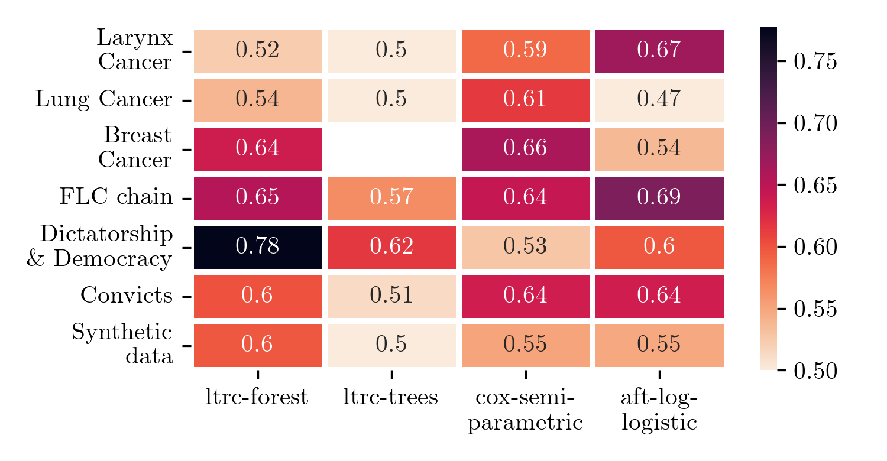

# Machine learning algorithm for survival analysis

## LTRC trees and LTRC Random Forest

### Usage

```python
import numpy as np
from survival_trees import RandomForestLTRCFitter
from survival_trees.metric import time_dependent_auc
from lifelines import datasets
from sklearn.model_selection import train_test_split

# load dataset
data = datasets.load_larynx().dropna()
data["entry_date"] = data["age"]
data["time"] += data["entry_date"]
y = data[["entry_date", "time", "death"]]
X = data.drop(columns=y.columns.tolist())

# split dataset    
x_train, x_test, y_train, y_test = train_test_split(
    X, y, train_size=0.7)

# initialise and fit model    
model = RandomForestLTRCFitter(
    n_estimators=30,
    min_impurity_decrease=0.0000001,
    min_samples_leaf=3,
    max_samples=0.89)
model.fit(
    data.loc[x_train.index],
    entry_col="entry_date",
    duration_col="time",
    event_col='death'
)


survival_function = - np.log(model.predict_cumulative_hazard(
                    x_test).astype(float)).T

auc_cd = time_dependent_auc(
    - survival_function, 
    event_observed=y_test.loc[survival_function.index].iloc[:, 2],
    censoring_time=y_test.loc[survival_function.index].iloc[:, 1])

```

## Implementation details

**LTRC - trees** Based on Rpart algorithm

**Splitting method -- log rank test**

Denote $(D_i, R_i, \delta_i)$ respectively the survival/censored time, the left truncation time and the event indicator,
then for each instance $i$ its contribution to the residual deviance $d_i = 2\left[\delta_i \log \left( \dfrac{\delta_i}{(\hat{\Lambda}_0(R_i) - \hat{\Lambda}_0(L_i)) \hat{\theta}} \right) - \left(\delta_i - (\hat{\Lambda}_0(R_i) - \hat{\Lambda}_0(L_i))\hat{\theta} \right) \right]$ with $\hat{\theta} = \sum \delta_i / \sum (\Lambda_0(R_i) - \Lambda_0(L_i))$

**Extension to LTRC - forest**

- build m independent LTRCART using bootstrap procedure
- Random feature selection layer
- Compute the average estimation $\hat{s}(t, \textbf{x}) = 1/n\sum_{j \leqslant n} \tau_j(t, \textbf{x})$

## Benchmark



## Install notice

To install the package you can run

    python -m pip install git+https://gitlab.eurobios.com/vlaurent/survival-trees

## References

* https://academic.oup.com/biostatistics/article/18/2/352/2739324

## Requirements

Having `R` compiler installed

## Project

This implementation come from an SNCF DTIPG project and is developped and maintained by Eurobios Scientific Computation
Branch and SNCF IR


## Authors

- Vincent LAURENT : vlaurent@eurobios.com
