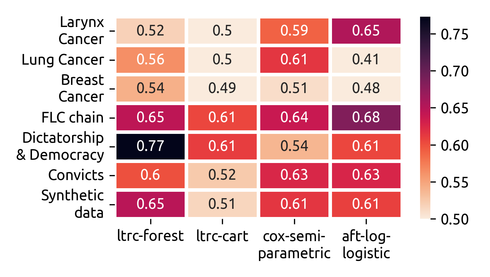

# Machine learning algorithm for survival analysis

## LTRC trees and LTRC Random Forest

**LTRC - trees** Based on partykit and Rpart algorithm (conditional inference) \cite{hothorn2006unbiased} \newline

**Splitting method -- log rank test**

Denote $`D_i, L_i, \delta_i`$ respectively the survival/censored time, the left truncation time and the event indicator, then for each instance $`i`$ its contribution to the logrank test score is

- $`U_i = 1 + \log(R_i) - \log(L_i)`$ if  $`\delta_i = 1`$  and
- $`U_i = \log(R_i) - \log(L_i)`$   if $`\delta_i = 0`$

**Extension to LTRC - forest**

- build $`n`$ independent LTRC-trees $`\tau_j`$
- Bootstrap procedure
- Random feature selection layer
- Compute the average estimation $`\hat{s}(t, \textbf{x}) = 1/n\sum_{j \leqslant n} \tau_j(t, \textbf{x})`$

## Benchmark

## Install notice

To install the package you can run

    python -m pip install git+https://gitlab.eurobios.com/vlaurent/survival-trees

## References

* https://academic.oup.com/biostatistics/article/18/2/352/2739324

## Requirements

Having `R` compiler installed

## Project

This implementation come from an SNCF DTIPG project and is developped and maintained by Eurobios Scientific Computation Branch

## Authors

- Vincent LAURENT : vlaurent@eurobios.com
